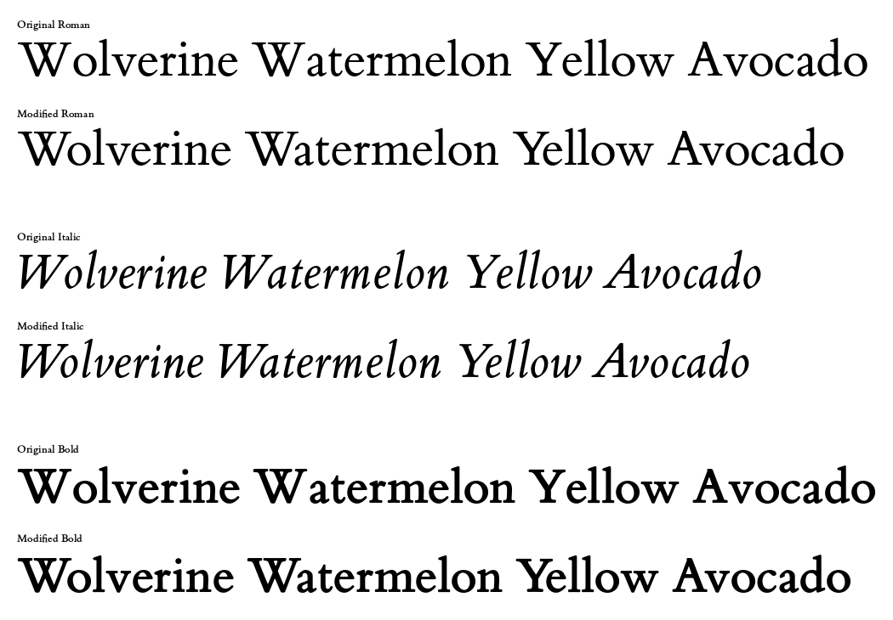

# ETBook W

This is a slightly modified version of [ET Book](https://github.com/edwardtufte/et-book/) (formerly known as ETBembo) originally designed by Dmitry Krasny, Bonnie Scranton, and Edward Tufte.

This version adjusts some kerning issues, originally of "W" - hence the "W" in the name.

I am not saying that this version is perfect. Some of the adjusted spacing might be too much or too little, and there are most likely combinations that I have missed. This is going to be a Work in Progress.

## Example



## Building

```sh
python3 -m venv .venv
.venv/bin/python3 -m pip install -r requirements.txt
.venv/bin/python3 build.py
```
